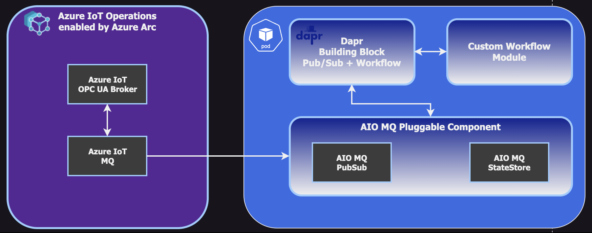
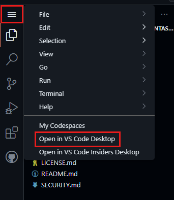
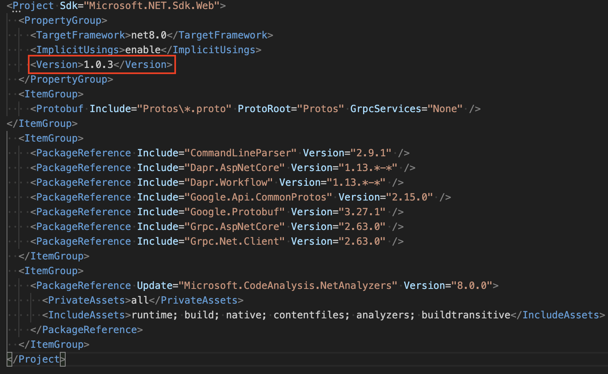

# Azure Edge Extensions - AIO Dapr Workflow

> [!IMPORTANT]  
> This repositories is compatible with Azure IoT Operations [v0.7.31](https://github.com/Azure/azure-iot-operations/releases/tag/v0.7.31).

This project is a sample demonstrating how to build custom workloads for [Azure IoT Operations (AIO)](https://learn.microsoft.com/en-us/azure/iot-operations/get-started/overview-iot-operations) utilizing its Azure IoT MQ component and the [Dapr Workflow](https://docs.dapr.io/developing-applications/building-blocks/workflow/workflow-overview/) building block.

## Overview

Industry requirements frequently extend beyond the capabilities of the built-in Azure IoT Operations (AIO) components. Hence there is a need to build custom workloads in any programming language of their choice.

Dapr provides a very flexible runtime being used aside of your application code to provide a set of building blocks that can be used to build microservice-based applications. One of these building blocks is the Workflow building block, which allows you to define a sequence of steps that can be executed in a distributed manner. This gives you the opportunity to execute long-running operations using the DurableTask framework, without the need to implement complex orchestration logic.

The Dapr runtime spins up a sidecar container that runs the Dapr APIs like the Dapr Workflow or Pub/Sub building block. This sidecar container is responsible for executing the workflow steps defined in the workflow application. Dapr also comes up with an interface for pluggable components to extend functionality by using custom components. Azure IoT Operations provides its own pluggable components to use Azure IoT MQ as a messaging layer (pub/sub) or state store.

## Solution Architecture

The architecture design of this solution is built on top of the Azure IoT Operations platform and utilizes messaging capabilities provided by the Azure IoT MQ component. Custom workloads can be easily plugged by using both the Dapr Pub/Sub and Dapr Workflow building blocks and their APIs that are provided in a sidecar architecture, consumable via http or grpc. Exensibility of the Dapr runtime enables to inject pluggable components to make Azure IoT MQ available as a Pub/Sub and StateStore component.

The custom workload is a .NET application that leverages the Dapr PubSub building block to subscribe and publish messages to the Azure IoT MQ broker. The application itself implements a Dapr Workflow to orchestrate the order of single steps that can be used to enrich, transform, filter or even publish data.

The following diagram illustrates the architecture of the solution:


## Features

This project framework provides the following features:

* A Visual Studio Dev Container with the required developer tools and Visual Studio extensions (.NET, PowerShell, Azure CLI, K9s, MQTTUI, Mosquitto client tools)
* Dev Container is initialized with a local K3D container registry
* Script for Azure Arc enabling the local cluster and deploying Azure IoT Operations
* Sample .NET application leveraging Dapr PubSub Pluggable component to subscribe and publish and implementing a Dapr Workflow
* Makefile to build and deploy the custom application into the cluster

## Getting Started

### Prerequisites

* Visual Studio Code
* [Dev container support in Visual Studio Code](https://code.visualstudio.com/docs/devcontainers/tutorial)
* Azure account with permissions to provision new resources, query the Azure Resource Graph and create Service Principals

### Installation

1. Fork this repository to your own GitHub account or use it from the original repository
2. `cd azure-edge-extensions-aio-dapr-workflow`
3. [](https://codespaces.new/Azure-Samples/azure-edge-extensions-aio-dapr-workflow?quickstart=1)
4. Once the codespace is ready, select the menu button at the top left, then select Open in VS Code Desktop

5. Once the setup has been initialized, the dev container will have initialized K3D local container registry for development purposes. The environment is now ready for deploying the K3D cluster, initializing Azure IoT Operations and Azure Arc. The container registry is available inside the dev container and inside the K3D cluster under `k3d-devregistry.localhost:5500`

### Quickstart: Deploy Azure IoT Operations

* Open a shell terminal to run all of the following scripts
* Login into your Azure tenant and set a default subscription

``` bash
az login # optionally add --tenant "<tenant_id>"
az account set --subscription "mysubscription_name_or_id"
az account show
```

* Run `make` in the root folder of the workspace to deploy the K3D cluster, Azure Arc-enable the cluster, install Azure IoT Operations and deploy the Dapr Workflow application as well. If you want to deploy only a specific target in the makefile you can run `make <target>`.

### Publish Data to Azure IoT MQ

1. Open a new Terminal in VS Code and run:
`kubectl exec --stdin --tty mqtt-client -n azure-iot-operations -- sh`
2. At the shell in the mqtt-client pod, run the following command to publish to the MQ broker using the mosquitto client:
`mosquitto_pub --host aio-broker --port 18883 --message '{"ambient":{"temperature":10}}' --topic "telemetry" --debug --cafile /var/run/certs/ca.crt -D CONNECT authentication-method 'K8S-SAT' -D CONNECT authentication-data $(cat /var/run/secrets/tokens/broker-sat)`
3. Verify that an enriched message is publish on the telemetry-enriched topic by running the following command in another terminal window (step 1 required as well):
`mosquitto_sub --host aio-broker --port 18883 --topic "enriched-telemetry" --debug --cafile /var/run/certs/ca.crt -D CONNECT authentication-method 'K8S-SAT' -D CONNECT authentication-data $(cat /var/run/secrets/tokens/broker-sat)`

### Deploy a new version of the application

* update the version tag in the application´s project file

* run `make build_dapr_workflow_app deploy_dapr_workflow_app` to re-build and re-deploy the application

## Resources

* [Azure IoT Operations Official Documentation](https://learn.microsoft.com/en-us/azure/iot-operations/)
* [AIO MQ Broker - Secure MQTT Endpoints](https://learn.microsoft.com/en-us/azure/iot-operations/manage-mqtt-connectivity/howto-configure-brokerlistener)
* [Manage secrets for your Azure IoT Operations deployment](https://learn.microsoft.com/en-us/azure/iot-operations/deploy-iot-ops/howto-manage-secrets)
* [Azure IoT Operations - Use Dapr to develop distributed application workloads](https://learn.microsoft.com/en-us/azure/iot-operations/develop/howto-develop-dapr-apps) - covers MQ's Dapr PubSub and StateStore Pluggable components
* [Dapr](http://dapr.io)
* [Dapr Workflow Building Block](https://docs.dapr.io/developing-applications/building-blocks/workflow/workflow-overview/)
* [Recommended sibling repo: Azure Edge Extensions Inner Developer Loop](https://github.com/Azure-Samples/azure-edge-extensions-aio-dapr-net-devcontainer-k3d)
